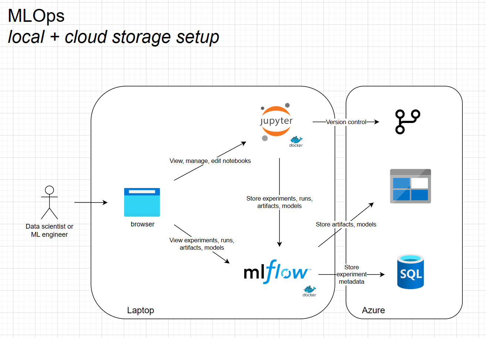

# MLOps with MLFlow

This repo maps out an MLOps infrastructure utilizing the following technologies:

- [Jupyter notebooks](https://jupyter.org/) for hosting and managing data science and machine learning activities
- [MLFlow](https://mlflow.org/) for tracking experiments, experiment runs, experiment metadata (input parameters and output metrics), experiment artifacts (curated datasets, etc.) and trained models
- [Azure blob storage](https://azure.microsoft.com/en-us/products/storage/blobs/) as artifact backing store
- [SQL Server](https://www.microsoft.com/en-us/sql-server/) as experiment metadata backing store

## Local-only configuration


- All services run as Docker containers on your local workstation

### Requirements

- [Docker Desktop](https://www.docker.com/products/docker-desktop/)
- Bash or other Unix-style shell ([WSL2](https://learn.microsoft.com/en-us/windows/wsl/) on Windows)

### Instructions

- clone this repo
- open a shell in the repo folder root
- run [start.local.sh](./start.local.sh)

    ```bash
    > ./start.local.sh
    ```

- wait for all containers to build and start (may take a few minutes)
- follow the remaining [common instructions](#common-instructions)

## Local + cloud storage configuration



- Jupyter and MLFlow servers run as Docker containers on your local workstation
- Cloud-based Azure storage
- Cloud-based SQL storage

### Requirements

- [Docker Desktop](https://www.docker.com/products/docker-desktop/)
- Bash or other Unix-style shell ([WSL2](https://learn.microsoft.com/en-us/windows/wsl/) on Windows)
- A new or existing Azure storage account (how to [create](https://learn.microsoft.com/en-us/azure/storage/common/storage-account-create?tabs=azure-portal) a new one)
- [Add a new blob container](https://learn.microsoft.com/en-us/azure/storage/blobs/blob-containers-portal#create-a-container) to the storage account called _artifacts_
- A [new Azure SQL Database](https://learn.microsoft.com/en-us/azure/azure-sql/database/single-database-create-quickstart?view=azuresql&tabs=azure-portal) called _mlflowmetadata_

### Instructions

- clone this repo
- open a shell in the repo folder root
- edit [start.cloud.sh](./start.cloud.sh) and ensure the AZURE_STORAGE_CONNECTION_STRING and MLFLOW_DEFAULT_ARTIFACT_ROOT variables point to your storage account/container, and the MLFLOW_BACKEND_STORE_URI variable points to your SQL database
- run [start.cloud.sh](./start.cloud.sh)

    ```bash
    > ./start.cloud.sh
    ```

- wait for all containers to build and start (may take a few minutes)
- follow the remaining [common instructions](#common-instructions)

## Cloud configuration


- All services run in Azure cloud
- Enables multi-user collaboration and durable storage of metadata and artifacts

### Instructions

- _TBD_

## Common Instructions

- open JupyterLab by navigating to http://localhost:8888/?token=dtic
- open the [mlflow_test.ipynb](./mlflow_test.ipynb) notebook and run all cells, in order
- open another browser tab and navigate to the MLFlow UI at http://localhost:5000
- view the details of run1 and run2 under experiment1
- go back to the notebook, try adding new experiments and runs... explore other APIs in the [MLFlow Python library](https://mlflow.org/docs/latest/python_api/index.html)